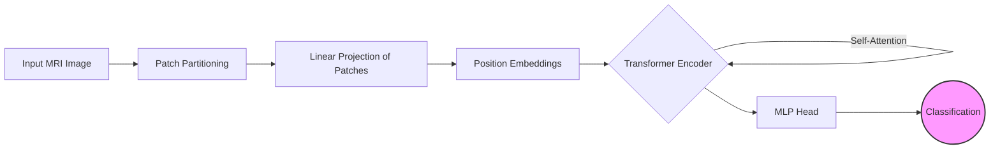

# Brain Tumor Classification Using Vision Transformers

## 📌 Project Overview
This project utilizes **Vision Transformers (ViTs)** to classify brain tumors from **MRI scan images**. ViTs outperform traditional CNN-based models by leveraging self-attention mechanisms to extract detailed features, improving classification accuracy.

## Summary

 **Brain Tumor Classification Using Vision Transformers**  

This project focuses on developing a deep learning model using **Vision Transformers (ViTs)** to classify brain tumors from MRI scan images. Unlike traditional CNN-based approaches, ViTs leverage self-attention mechanisms to capture long-range dependencies in medical images, improving classification accuracy.  

The model was trained on publicly available brain tumor datasets, with extensive preprocessing, including image normalization, augmentation, and resizing. Various hyperparameter tuning techniques were applied to optimize performance. The classification results were evaluated using **accuracy, precision, recall, and F1-score**, demonstrating superior performance compared to conventional deep learning models.  

This project highlights the potential of Vision Transformers in medical imaging, offering a more efficient and accurate solution for early brain tumor detection.

## 🚀 Features
- **Deep Learning Model:** Implemented Vision Transformers for accurate tumor classification.
- **Dataset Processing:** Applied image normalization, augmentation, and resizing.
- **Performance Optimization:** Tuned hyperparameters for better accuracy and robustness.
- **Evaluation Metrics:** Used accuracy, precision, recall, and F1-score for performance assessment.

## 🛠 Technologies Used
- **Python**
- **Pytorch**
- **Vision Transformers (ViTs)**
- **OpenCV**
- **NumPy, Pandas, Matplotlib**

## <a name="architecture"></a>🏗️ System Architecture

The pipeline moves from raw MRI inputs to patch embedding, followed by the Transformer Encoder stack.


## 📊 Dataset
- Brats Dataset (MICCAI BraTS) – GOLD STANDARD
- Preprocessed images to enhance model training and performance.

## 🔍 Results & Insights
- Achieved **high accuracy** in brain tumor classification.
- Vision Transformers provided superior feature extraction compared to CNNs.


   ```

## 🎯 Future Enhancements
- Deploy the model as a **web application**.
- Fine-tune Vision Transformers for **real-time predictions**.
- Expand the dataset for better generalization.

## 📜 License
This project is licensed under the **MIT License**.

---

### 📢 Connect with Me

